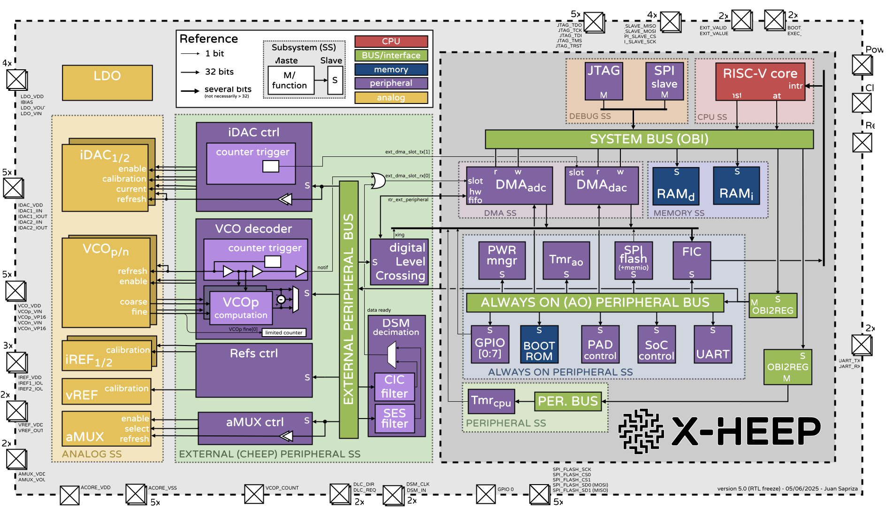
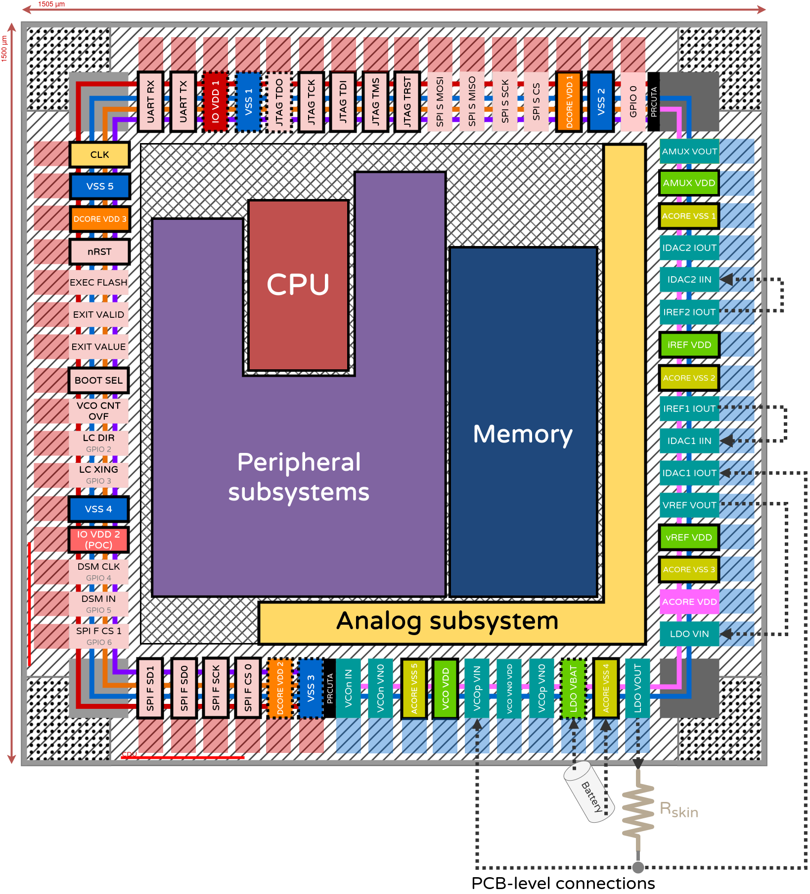
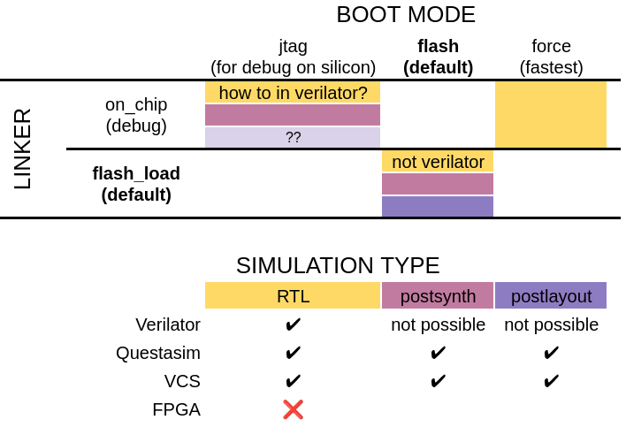
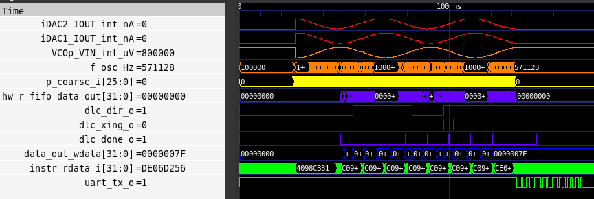

# Welcome!

<p align="center"></p>

HEEPidermis is a chip based on the open-source RISC-V platform [X-HEEP](https://github.com/esl-epfl/x-heep) intended to record Galvanic Skin Response (GSR) and Impedance (Z).
HEEPidermis is capable of injecting arbitrary-wave currents on the skin with an 8-bit iDAC and measure voltage through a 14-bit VCO-based ADC.
Parameters of the iDAC and ADC can be programmed dynamically using the on-board Ibex CPU. Acquired data can be stored in the 16 kB RAM memory for on-chip processing, compression, and transmission.

HEEPidermis can be interfaced through JTAG for code-debugging, SPI to obtain recordings from memory, or UART.
External ADCs and peripherals can also be commanded via SPI.

The Direct Memory Access (DMA) block allows the chip to operate autonomously without the constant interaction of the CPU. Given proper configuration, the DMA can take care of controlling the current injection profile, read data from the local ADC (or an external one), store data and/or transmit it through SPI.
The DMA can additionally re-direct data to a digital Level Crossing (dLC) block to filter data and reduce the output data rate. The output of the dLC can be stored in memory (along timestamps) or be exposed to be used as feedback loop for the analog front-end, interface with transmission circuits or as input to Spiking Neural Networks.
The dLC block also accepts inputs from analog LC ADCs (instead of the on-chip ADC).

HEEPidermis can also decimate 1-bit ΔΣ-ADCs' output with an integrated CIC filter or, alternatively, with an integrated custom smoothing stage, followed by the dLC block.

Being based on the X-HEEP platform, you can check its documentation on how to program, debug, or understand how it was built. We suggest using the [vendorized X-HEEP's documentation](../../hw/vendor/x-heep/docs/source/index.rst).
For all HEEPidermis-specific documentation, please refer to the documentation below.

<p align="center"></p>

<p align="center"></p>


## Index

- **Analog Front End**
  - [Analog subsystem](hw/ip/analog_subsystem/README.md)
  - [iDAC](hw/vendor/analog-library/iDAC/docs/README.md)
  - [VCO](hw/vendor/analog-library/VCO/docs/README.md)

- **Digital Back End**
  - [CPU](./docs/source/DBE/CPU.md)
  - [DMA (how we use it)](./docs/source/DBE/DMA.md)
  - [DMA](hw/vendor/x-heep/docs/source/Peripherals/DMA.md)
  - [SPI host](hw/vendor/x-heep/docs/source/Peripherals/SPI.md)
  - [SPI slave](hw/vendor/x-heep/docs/source/Peripherals/SPI_slave.md)
  - [digital Level-Crossing](hw/vendor/x-heep/docs/source/ExternalPeripherals/dLC.md)
  - [ΔΣ decimation (CIC filter)](./docs/source/DBE/CIC_filter.md)
  - [ΔΣ decimation (SES filter)](./docs/source/DBE/SES_filter.md)

- **Related documents**
  - [HEEPidermis](https://arxiv.org/abs/2509.04528)
  - [ΔΣ Decimation theory](https://ieeexplore.ieee.org/abstract/document/11044062)
  - [iDAC precursor](https://ieeexplore.ieee.org/document/11044212)
  - [VCO Design](https://arxiv.org/abs/2509.06698)

## Prerequisites

Since this project is based on _X-HEEP_, it has the same prerequisites.

1. Follow _X-HEEP_'s [_Prerequisite_](https://github.com/esl-epfl/x-heep/tree/main#prerequisite) section to download the necessary tools.
To correctly generate hardware and software, an extended version of the _core-v-mini-mcu_ environment is required. To install it run:
   ```Bash
   make conda
   ```
Make sure the Conda environment is active:
   ```Bash
   conda activate heepidermis
   ```

2. Make sure that the following tools are available in your system's `PATH`:
   - RISC-V toolchain (supporting at least `rv32imc`)
   - Verible
   - GTKWave
   - Siemens QuestaSim version 2020.4 or above
   - Synopsys Design Compiler version 2020.09 or above
   - Verilator 4


### RTL Simulation

The included [`makefile`](./makefile) proves all the necessary rules to build _HEEPidermis_:


1. Generate all the RTL files (and software headers):
   ```bash
   make cheep-gen
   ```
   Some _X-HEEP_ configuration parameters (e.g. `BUS`, `MEMORY_BANKS` etc.) are still supported, although the default configuration may differ (check [`peripherals_config`](./config/peripherals_config)). In general, these should not be passed through the makefile targets but should be configured in the hjson files in the `config` folder.

2. Build the simulation model:
   ```bash
   make verilator-build     # Verilator
   make questasim-build     # QuestaSim
   ```

3. The software build process is primarily handled by _X-HEEP_, and most of its [example applications](./hw/vendor/x-heep/sw/applications/) will work on _HEEPidermis_ as well. You can choose other `BOOT_MODE`, just be sure to match it with the one used with `make *-build` (by default they use `fore`). `force` will be the faster for simulation.

```bash
make app PROJECT=test_dlc_vco BOOT_MODE=force
```

The combinations of compatible linker and boot modes can be found here:
<p align="center"></p>


1. Launch the simulation with the compiled firmware:
   ```bash
   make verilator-run       # Verilator with waveforms dump
   make verilator-opt       # Verilator without waveforms dump
   make questasim-run       # QuestaSim
   make questasim-gui       # QuestaSim with GUI
   ```

   You can also set other parameters like the `FUSESOC_FLAGS`, `LOG_LEVEL`, `BOOT_MODE`, `VCD_MODE`, etc. to customize the simulation. Refer to the [`makefile`](./makefile) for more details.

2. _HEEPidermis_ `stdout` is exposed through a UART DPI interface at `/dev/pts/<N>`, where `N` is a number printed on the simulation log during execution. You can connect to it using `screen` or similar tools, e.g.:
   ```bash
   screen /dev/pts/0
   ```
   The UART output is also stored to the `uart.log` file in the common simulation directory (`build/sim-common/uart.log`).
   > Using `printf()` will significantly increase the firmware execution time and therefore the simulation. For quick debugging, it recommended to use the return value from `main` instead. When it is _not_ zero, the testbench will print it out at the end of the simulation.

3. The waveforms dumped during the simulation can be opened using:
   ```bash
   make verilator-waves # after Verilator simulation
   make questasim-waves # after QuestaSim simulation
   ```

This will open the waveforms (example from `test_dlc_vco` application):
<p align="center"></p>


Assuming that your firmware is already available, steps 1., 3., and 4. can be repeated with a single command using the `verilator-sim` or `questasim-sim` targets.


# Questions?

Have questions? curiosities? ideas on how to exploit HEEPidermis? Want to contribute on following versions of the SoC?
Drop an email :) juan.sapriza@epfl.ch