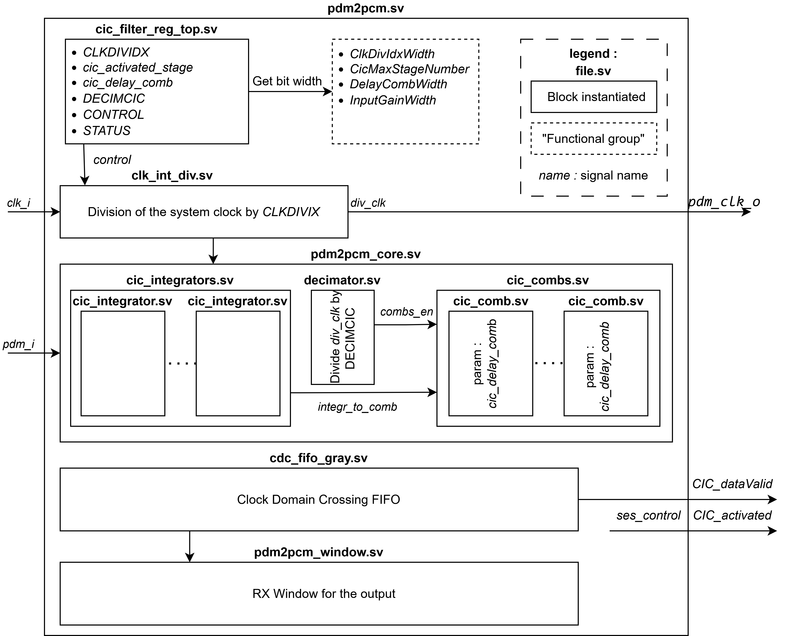
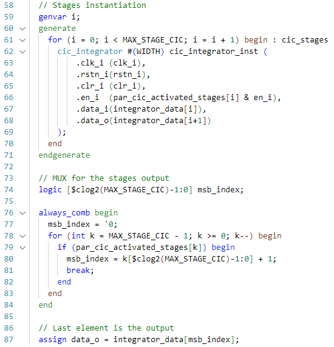
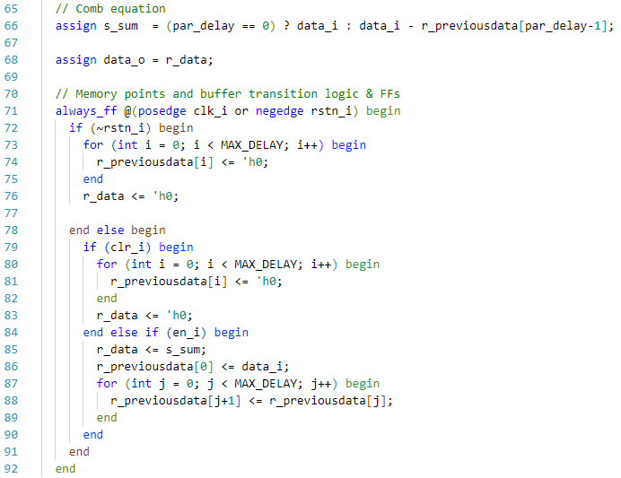
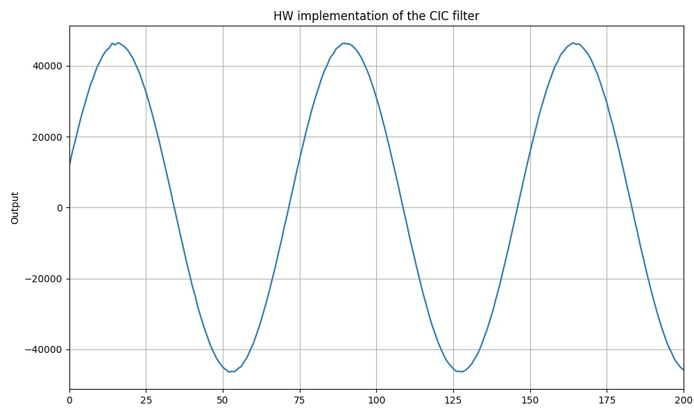
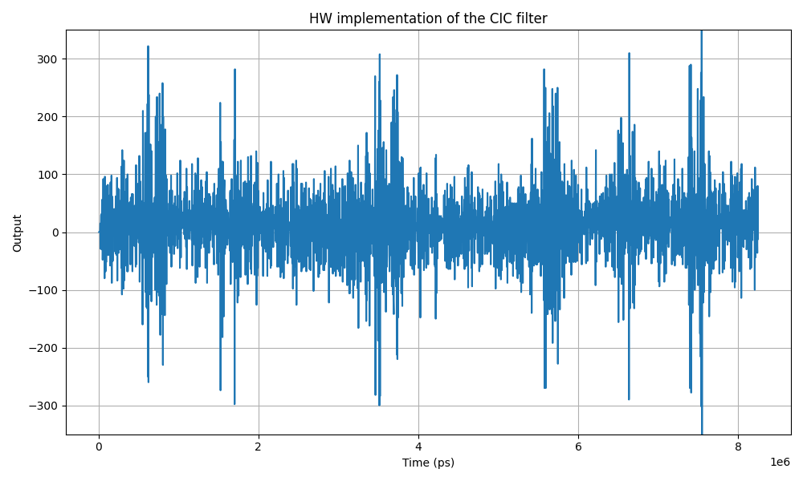

# CIC filter

The CIC filter is implemented as a simplified version of the existing `PDM2PCM` block in the X-HEEP platform. This is achieved by adding a configuration flag, `cic_only`, in the `mcu_cfg.hjson` file. During the `mcu-gen` process, this flag instructs the Python generation scripts to output a reduced SystemVerilog implementation tailored for CIC-only operation, using Mako templates.

For clarity and conciseness, the remainder of this section focuses exclusively on the reduced CIC-only configuration of the block, highlighting the specific modifications made to the original `pdm2pcm` implementation. Additionally, topics shared with the SES filter are covered in greater detail in the corresponding SES section.

*Figure: Top level system verilog architecture representation*

## Runtime configurability

This implementation utilizes X-HEEP’s register abstraction to enable seamless communication between C code and SystemVerilog, as detailed in Section SES filter. In the case of the CIC filter, the relevant memory-mapped registers are defined in `pdm2pcm.hjson`.

The following registers are used in the CIC filter configuration:

- **CONTROL** (2 bits): Software control register. The LSB enables or disables the filter; the MSB clears the FIFO buffer.
- **STATUS** (2 bits): Indicates filter status. The LSB signals whether the FIFO is empty, while the MSB indicates if it is full.
- **DECIMCIC** (4 bits): Sets the decimation factor applied between the sampling frequency and the output rate.
- **CLKDIVIDX** (16 bits): Configures the divider between the system clock and the sampling clock.
- **cic_activated_stages** (6 bits): Thermometric, right-aligned bitmask specifying the active CIC stages. The 1s must be contiguous.
- **cic_delay_comb** (4 bits): Defines the delay parameter \( D \) used in the comb stage.
- **RXDATA** (32 bits): Provides access to the filtered output data through a memory-mapped FIFO window.

Detailed information regarding access permissions and bitfield definitions can be found directly in the corresponding `.hjson` configuration file.

## Automatic width adaptation

As for the SES filter, the CIC was updated to allow configuration directly from the width of the register. See more in the corresponding section.

## Integrators and combs

*Figure: integrators.sv code snippet, showing the output MUX'ing and the stage generation*

The files `integrators.sv` and `combs.sv` define their respective sections of the CIC filter as parameterized generate blocks. A configurable number of stages is instantiated based on the design parameter `MAX_STAGE_CIC`, with each stage connected in series. This parameter is determined at compile time by checking the width of the `par_cic_activated_stages` register. Stage activation is controlled by the thermometric input `par_cic_activated_stages`, allowing runtime flexibility.

A small combinational logic block scans this activation mask to determine the highest active stage and selects its output for `data_o`. This enables dynamic configuration of the filter depth while maintaining a compact and hardware-efficient implementation.

## Delay D in comb

This block implements a single-stage comb filter, which forms part of the CIC decimation chain. The parameter `par_delay` defines the delay D used in the comb difference equation. Depending on the value of `par_delay`, the filter either bypasses subtraction (when delay is 0) or computes the difference between the current input `data_i` and a delayed version stored in `r_previousdata[par_delay - 1]`.

To support runtime selection of the delay, a shift register of size `MAX_DELAY` stores recent input samples. On each clock cycle (when `en_i` is asserted), the new input is inserted at index 0, and all previous values are shifted forward. This allows the output difference to be computed with any delay value up to `MAX_DELAY`, providing runtime flexibility while maintaining hardware simplicity.

*Figure: comb.sv code snippet, showing the usage of the delay parameter*

## Results

*Figure: Proof of concept, using a perfect sinusoid as input*

*Figure: Hardware output of the iEEG_10000Hz_85OSR_65dBFS sample file*

The results obtained for the sinusoidal input closely match the expected ground truth, demonstrating correct filter behavior. Additionally, the output for real EEG signals appears clean and free of significant artifacts. These observations support the successful validation of the project objective.

## Usage

An example of the filter's usage from the software side is provided in the `example_cic` project. This program validates the functionality of the CIC block by comparing its output against predetermined ground truth values.
