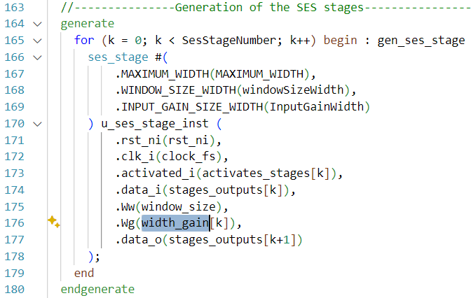

## SES Filter

### Introduction

The filter implemented is a variant of Brown’s Simple Exponential Smoothing (SES) algorithm, adapted for low-power, hardware-efficient delta-sigma post-processing. Originally proposed by Sapriza et al., this SES filter provides a tunable and lightweight alternative to classical CIC filters, supporting runtime reconfiguration with minimal computational overhead.

In the context of *HEEPidermis*, the SES algorithm is expressed using shift-based arithmetic, making it highly suitable for hardware implementation without multipliers. The recursive formulation is as follows:

\[
    \begin{cases}
        \widehat{Y}_i = \widehat{Y}_{i-1} - \widehat{y}_{i-1} + \left(x_i \ll (W_g - 1)\right) \\
        \widehat{y}_i = \widehat{Y}_i \gg W_w
    \end{cases}
\]

Here, $\widehat{Y}_i$ represents the internal state (accumulator), $x_i$ is the 1-bit delta-sigma input scaled by $W_g$, and $W_w$ controls the smoothing strength. This structure enables tunable decimation and filtering with minimal resource usage, making it well-suited for ultra-low-power biomedical applications.

*Figure: Schematic representation of the SES filter architecture, showing individual processing stages and the output stage.*

---

### Setup

This setup assumes the installation from the Setup section was executed successfully. The following steps are based mostly on the README from the HEEPidermis GitLab repository.

If everything is set up correctly:

1. Fork the *HEEPidermis* repository to your personal GitLab account and clone it locally.
2. From the root directory of the cloned project, create the required Conda environment.

Once the environment is configured, the complete compilation and simulation flow is:

1. `make cheep-gen` — Generates the configured MCU architecture.
2. `make verilator-build` — Compiles the SystemVerilog sources and builds the simulation model using Verilator.
3. `make app PROJECT=myProject BOOT_MODE=force` — Compiles the C application specified by `myProject`.
4. `make verilator-run BOOT_MODE=force` — Runs the compiled application in the Verilator simulation environment.

---

### Implementation

#### Top level

The system is implemented in a newly created block with a top-level called `ses_filter.sv`. The general "software" architecture with the most important signals is shown below:

*Figure: Top level system verilog architecture representation*

The design begins by downsampling the system clock to generate a lower-frequency sampling clock, referred to as `clock_fs`. This sampling clock drives the filter pipeline. To safely transfer data back to the system clock domain, a Clock Domain Crossing (CDC) FIFO is used.

A detailed description of the input and output ports is provided in the header comments of the `ses_filter.sv` file.

---

#### Runtime configurability

As for the CIC, this code leverages the X-HEEP/HEEPidermis platform's capability to interface between C code and SystemVerilog through a register abstraction mechanism. The registers are specified in the `ses_filter.hjson` file and generated using the `make cheep-gen` command, which calls the SES_filter.sh script and `regtool.py`.

The following memory-mapped registers are defined:

- **ses_control** (1 bit): Enables or disables the SES filter via software control.
- **ses_status** (2 bits): Provides filter status. LSB: filter active, MSB: new output data available.
- **ses_window_size** (5 bits): Sets the window size parameter \( W_w \) used in the filter computation.
- **ses_decim_factor** (10 bits): Defines the decimation factor applied between the sampling clock and the output rate.
- **ses_sysclk_division** (10 bits): Specifies the division factor from the system clock to the sampling clock.
- **ses_activated_stages** (6 bits): Thermometric, right-aligned bitmask indicating which SES stages are active. The 1s must be contiguous.
- **ses_gain_stages** (30 bits): Encodes the input gain \( W_{g,x} \) for each SES stage (5 bits per stage).
- **rx_data** (32 bits): FIFO window to retrieve filtered output data.

The files `ses_filter_reg_top.sv` and `ses_filter_reg_pkg.sv` are auto-generated and serve as the register interface. See the corresponding `.hjson` file for bitfield definitions.

---

#### Automatic width adaptation

*Figure: ses_filter.sv code snippet, register width extraction*

This design maximizes flexibility by deriving most width-related and structural parameters directly from the register definitions. These values are resolved at compile time, allowing their use in generate blocks and signal width declarations.

For example, the maximum number of SES stages is computed from the width of the corresponding register field. Increasing the maximum number of SES stages only requires adjusting the width of the field and updating the gain configuration in the `.hjson` file. The SystemVerilog code adapts automatically.

The only parameters not derived from register fields are the datapath width (statically 32 bits) and the FIFO depth.

---

#### System clock decimation

*Figure: ses_filter.sv code snippet, system clock decimation*

This block implements a clock divider that generates the sampling clock signal, `clock_fs`, by dividing the main system clock `clk_sys_i` according to the value in `ses_sysclk_division`. The resulting clock `clock_fs` drives the SES filter and is output as `clk_fs_o` to trigger the connected recording device.

The divider logic includes enable and reset handling.

---

#### SES stage generation and internal logic

*Figure: ses_filter.sv code snippet, SES stage generation*

The generate block instantiates the required number of SES stages based on the parameter derived from the register width. Each `ses_stage` instance is parameterized with maximum data width, window size width, and input gain width. Stages are connected sequentially, with output of stage `k` serving as the input to stage `k+1`. Stage activation and gain configuration are runtime configurable.

*Figure: ses_stage.sv code snippet, internal logic of a single stage*

The internal logic of a single SES stage implements the mathematical formulation given above. The `activated_i` signal enables complete deactivation for energy-efficient operation.

The input bitstream `data_i` is left-shifted by the gain factor `Wg` when the stage is active. A feedback loop using two's complement implements the accumulator. The sum is stored in `r_summed_value`, reset upon deactivation or global reset. Output `data_o` is obtained by right-shifting the sum by `Ww`.

---

#### Output stage

The final stage is responsible for selecting the correct output, decimating the sampling frequency, and interfacing with the CDC FIFO.

1. **Output Selection (MUX):** The highest active SES stage is selected using a multiplexer.
2. **Decimation Counter:** A counter driven by the sampling clock reduces the output rate by the configured decimation factor.
3. **Clock Domain Crossing (CDC):** A dual-clock FIFO bridges the sampling and system clock domains, delivering data via the memory-mapped interface.
4. **Status Reporting:** A status register combines control state and FIFO validity for software monitoring.

---

## Results

For the following plots, filter parameters were as described in the behavioral model by Juan Sapriza.

*Figure: Proof of concept, using a perfect sinusoid as input*

  

    
    
Behavioral model output of the iEEG_10000Hz_85OSR_65dBFS sample file

  

  

    
    
Hardware output of the iEEG_10000Hz_85OSR_65dBFS sample file

  

  

    
    
Behavioral model output, zoomed

  

  

    
    
Hardware output, zoomed

  

The comparison between the behavioral model and the hardware implementation shows strong agreement. Minor discrepancies are expected due to decimation effects, which result in slightly different input samples being processed. Overall, these results confirm successful validation of the project objective.

Additional graphs below explore the effects of parameter changes on the same input sample. Simulation time is limited to short segments.

  

    
    
Gain 0: 17, Window: 4, Stages: 5

  

  

    
    
Gain 0: 17, Window: 4, Stages: 3

  

With the architecture and software-level configurability in place, the next step would be to explore optimal filter configurations. This can now be done directly from software, enabling rapid, automated evaluation.

**NOTE**: The sample file can be found in the behavioral model repository.
