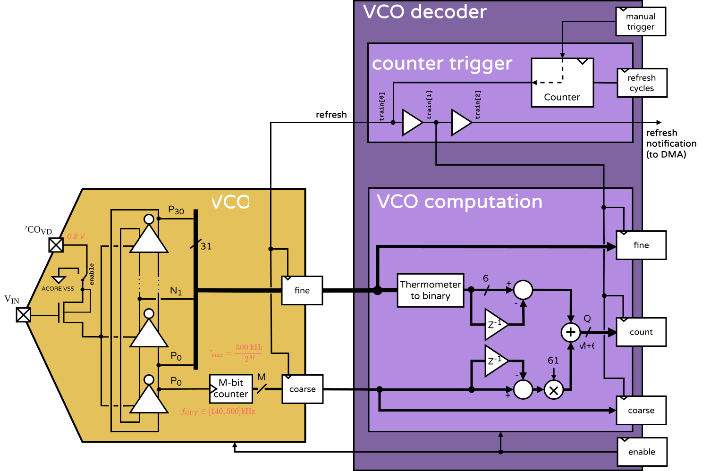
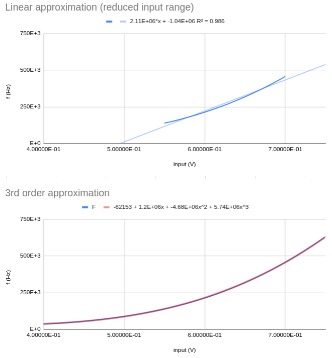
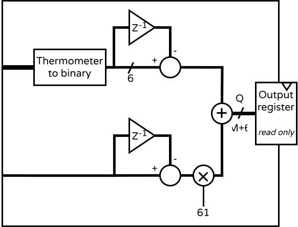
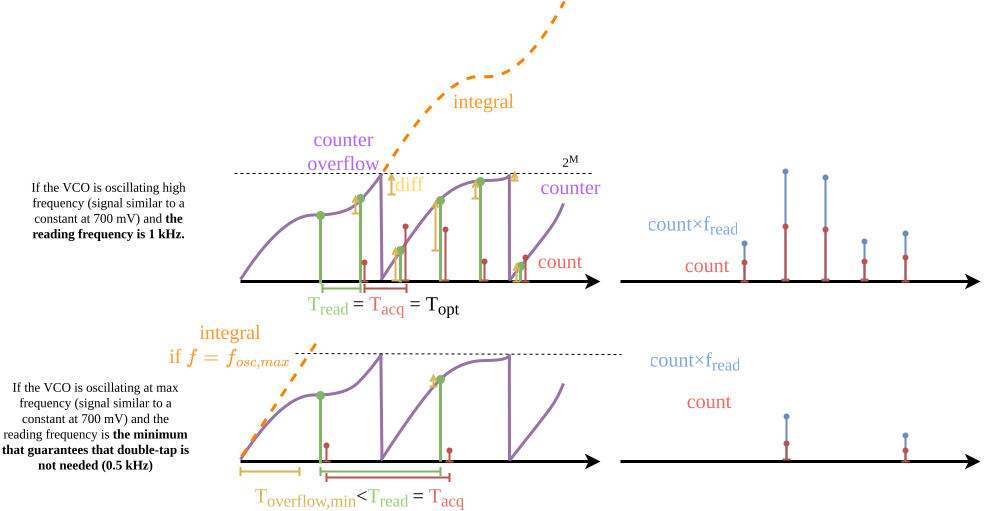
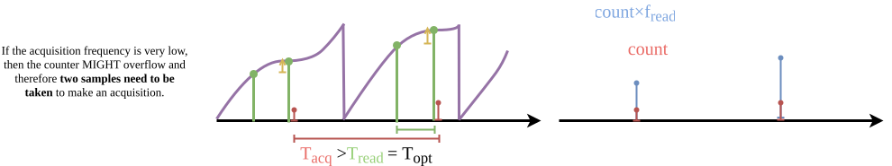

#  VCO-ADC

## About
The Voltage-Controlled Oscillator (VCO) based analog-to-digital converter (VCO-ADC) is a block that converts an input voltage into an oscillation frequency.

<p align="center"></p>


## Specifications

| Magnitude | Symbol | Value | Unit |
|-----------|--------|-------|------|
| Effective Number of bits | ENOB  | ~16  | bits  |
| Max sampling frequency  | $`f_{s,max}`$  | ❓  | Hz  |
| Min sampling frequency *  | $`f_{s,min}`$  | $`\frac{f_{osc,max}}{2^M}`$  | Hz  |
| Optimal sampling frequency  | $`f_{osc,opt}`$  | 3  | kHz  |
| Max oscillation frequency  | $`f_{osc,max}`$  | 500  | kHz  |
| Min oscillation frequency | $`f_{osc,min}`$  | 140  | kHz  |
| Max linear input voltage  | $`V_{in,lin,max}`$  | 700  | mV  |
| Min linear input voltage  | $`V_{in,lin,min}`$  | 500  | mV  |
| Counter depth  | $`M`$  | 32  | bits  |
| Inverters count  |   | 31  |   |
| **Implementation details**| | | |
| Dimensions |W×H | 350×100 | µm² |
| Area | | 0.035 | mm² |
| Leakage current | | TBD | |
| Current consumption | | 400 | nA |

*Frequency at which the M-bit counter would saturate if VCO oscillating at max speed.


## Operation

A VCO is a chain of an odd-number of inverters that operate in an oscillation regime. If one inverter outputs a digital `1`, the next one will output a digital `0`. Given the inverters are connected in a ring (thus the popular name "ring oscillator") the first inverter will see in its input a digital `1`, and therefore its output will be changed to a `0` and the chain will continue to vary. In an ideal case this would be an unsolvable paradox. However, the inverters take some time to invert their output, so there is a propagation delay. The speed of the inverters is related to the supply power. The higher the voltage or current the faster this inverters will propagate the change and, hence, the faster the ring will oscillate. A VCO uses the supply of the oscillators to translate voltage into frequency. In our VCO this is done through an NMOS operating as a [stopcock](https://ondemandsupplies.co.uk/wp-content/uploads/2022/11/Brass-Female-Threaded-Stopcock-122-BSP.png) that allows more or less current to flow into the inverters depending on the input voltage.

Any of the pins of the inverters can be used to increase a counter to monitor the oscillation frequency. In our case we (arbitrarily) use the output of the first oscillator.

By taking periodic readings of the counter value one can estimate how fast the VCO was oscillating and, from there, the input voltage. Because of this, the measurement of a VCO-ADC cannot be done immediately, instead the input voltage is "integrated" (by increasing the value of the counter), then differentiated (subtracting the new reading of the counter by the last obtained value) and finally averaged (divided by the time between measurements).

To increase the resolution of our VCO we use several stages (31) of differential inverters. This way we can compare the phase of each inverter with respect to the reference one. This will give us additional information (not only we know how many times the VCO oscillated, but also how far it was from the next inversion). More details in [the phase measurement](#the-phase-fine-measurement)


## The VCO transfer function

The V-f transfer function of the VCO-ADC (how voltage is translated into oscillation frequency) is sadly not linear. For voltages below ~500 mV the VCO will saturate at around 40 kHz. A similar thing happens towards voltages above 700 mV, but with the frequency increasing non-linearly. Between these values the transfer is fairly linear. To take proper measurements it is important to either:
1. Adjust the input to keep it always in the linear region (top plot).
2. Have the transfer function properly characterized (bottom plot).

<p align="center"></p>

View the simulated values [here](https://docs.google.com/spreadsheets/d/1eugsnF23oO4h4qERtD6Vjo5ZJ6i5j57y5fYUQxY7avY/edit?usp=sharing).

The resolution of the measurement of the VCO-ADC depends on the acquisition time (the time between the two samples taken). However, if the acquisition time is too long, many relevant pieces of the input signal might be lost (because of the averaging). For very low sampling frequencies, see [double-tap](#double-tap).


## The phase (fine) measurement

To increase the resolution of the VCO-ADC we measure the phase difference of the different inverters. Because they are differential inverters, each has two outputs: positive (P) and negative (N). Note that both outputs will be constantly oscillating, there is no "positive" value in any, they could have been called "red" and "blue" or "whinnie" and "poo"...

By taking the outputs interleaved (one P, one N) we can convert the obtained value from thermometer to binary in order to obtain a value related to "how much of the chain had been propagated at the time of the measurement". Because there are 31 inverters, there will be 62 possible different stages of the phase.

## The VCO decoder

The VCO decoder is the RTL block that interfaces between the full-custom digital side of the VCO-ADC and the external peripheral bus. It is responsible of triggering readings and computing the final value of the ADC.

In order to compute a value that reflects the input voltage the decoder does a few things:
1. **Differentiates the M-bit counter value** (coarse) to get the number of oscillations of the ring during that period.
>It would be techincally possible to reset the counter each time, but (a) that would require a reset that is faster than the faster oscillation frequency in order not to lose any cycle, (b) you would not be able to keep the phase information.
2. **Convert the phase values to binary** to obtain a 6-bit value of how much the signal had propagated
> 6-bits because there are 62 possible phase values.
3. **Differentiate the binary-phase value** (fine). This is analogous to point 1.
4. The coarse value is multiplied by 62 (because after 62 phases the counter would have been increased by 1).
5. **Sum the fine and coarse values** to get an M+6 bits output.

$`\hat{f}_{osc} = \frac{\int _{t_1}^{t_2} f_{osc}(V_{in}) dt}{t_2 - t_1} `$

$`\texttt{VCO\_decoder\_cnt} = \frac{t_2 - t_1}{2\cdot I\cdot \hat{f}}_{osc}`$

Where $`I`$ is 31, the number of inverters.

<p align="center"></p>


## Operational modes

The coarse output of the VCO can be of (theoretically) any bit depth as it only depends on M, the counter's depth. However, having a final output value that is not a multiple of 8 would be a waste of memory. We propose to make sure that $`Q`$ is either 16 or 32 bits.

We will derive some operational modes for the $`Q=16`$ case, but the same can be derived for $`Q=32`$.

Given that the phase noise $`\varphi_{noise}=75~\text{dB}`$, the quantization noise will match it at around $`Q=13~\text{bits}`$. This means that 3 bits from the 16-bit word obtained from the decoder will not add precision in the measurement, but rather will only allow for a longer recording without overflowing the counter.

Given that we have 31 inverters, the phase binary value will be $`q_f=6~\text{bits}`$, therefore $`q_c = M = 10~\text{bits}`$.

If the VCO is oscillating at maximum frequncy $`f_{osc,max}`$, the counter would overflow (make a full turn) in $`T_{ack,max}=\frac{2^M}{f_{osc,max}}`$.
For $`M=10,~f_{osc,max}=500~\text{kHz}`$ this yields $`T_{ack,max}=2~\text{ms}`$, or $`f_{s,min}=500~\text{Hz}`$.

For sampling frequencies below that, [double-tap](#double-tap) is needed.

The optimal operational point, where there is the best efficiency of resolution/bit happens to be at around 3.9 kHz, where the quantization/analog noise give way to phase noise.

<p align="center"></p>

In the image below two examples are shown. On both the input signal is around its maximum value (700 mV) and thus the VCO is oscillating close to maximum frequency. It can be seen that the counter (purple) is ($`_\text{but for a scaling factor related to the v-f transfer function's linear region slope}`$) tracking the signal's integral (orange).
Every time the counter reaches the limit ($`2^M`$) it overflows and starts again from 0, but keeps tracking the shape of the integral.
At a frequency of a few kHz (top case), the counter value is read every $`T_{read}`$ (green). The difference (yellow) between those two values is the output of the differentiation step for the coarse side of the VCO decoder (red). This value can then be multiplied to by the sampling frequency (and the proportionallity constant of the v-f transfer function) to obtain the voltage value of the input (blue).

In the bottom case, the reading period is too long, meaninig that there is a chance that the counter would have overflowed by the time of the next reading (it is the case in the figure). It is important to not sample less frequent that the maximum possible overflow period of the counter (assuming the case where the VCO is oscillating at max frequency).

<p align="center"></p>


## Double-tap

When you want to go for really low sampling frequencies you will have an issue: at some point the counter will saturate and your measurement will be garbage (see above).

In this case it is necessary to do a "double-tap" for each acquisition. Basically, you can acquire data as slow as you please, but the time between the two samples used to compute the difference should be inside the acceptable range (ideally spaced by the most efficient interval of $`\frac{1}{3.9~\text{kHz}}`$).


<p align="center"></p>


## Controlling it from software

For a general example, check `sw/applications/test_VCO_decoder/main.c`.

You can set the VCO refresh rate in clock cycles with:

```c
set_VCO_refresh_rate(1000);
```

You might need to wait some clock cycles before reading the values for the first time. This can be done for example by:

```c
for (int i = 0 ; i < 2000 ; i++) {
    asm volatile ("nop");
}
```

Then, you can read the values from the VCO-ADC with:

```c
uint32_t fine = get_VCO_fine();
uint32_t coarse = get_VCO_coarse();
uint32_t count = get_VCO_count();
```

## Questions?

| Topic | Responsible |
|---------------|---------------|
| Analog design | Matias Miguez, Jose Miranda, Leidy Albero |
| Controller |  David Mallasen |
| Behavioral models | Filippo Quadri |
| Full-custom digital | Filippo Quadri |
| General | Juan Sapriza |
