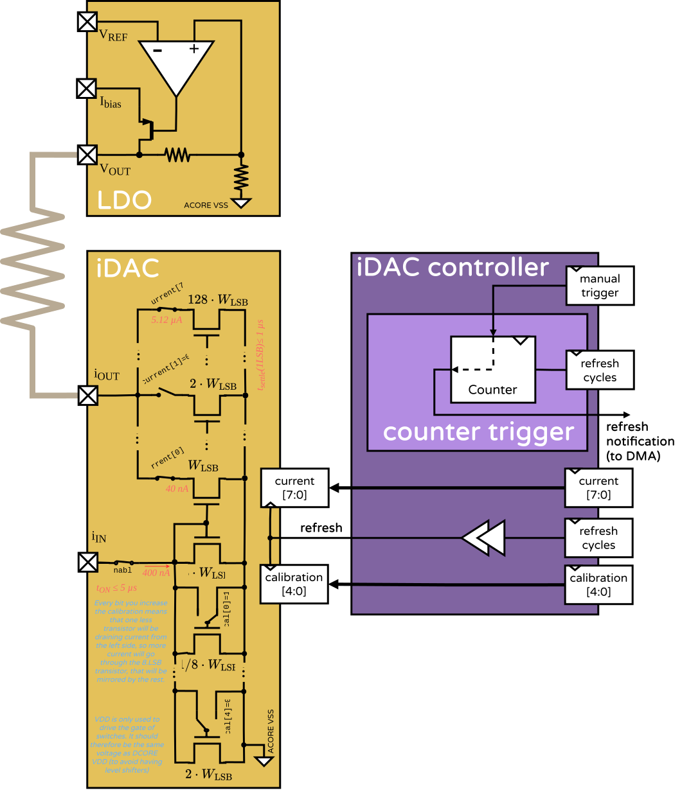

#  iDAC

## About

The current digital-to-analog-converter (iDAC) is an analog block capable of draining currents from 400 nA to 10 µA, in any arbitrary form through 8-bit reprogrammable register. In HEEPidermis it is used to drain a known DC current from the tissue that can be later measured by the [VCO-ADC](https://eslgit.epfl.ch/heep-ams-65/heepidermis/-/blob/main/docs/source/AFE/VCO.md?ref_type=heads). The system can adapt the drained current to set the measured voltage within the VCO's linear region. For application-flexibility, there are two semi-independent iDACs on HEEPidermis.

The iDAC is controlled by the microcontroller via an iDAC controller. The iDAC is in charge of setting an output current given the parameters set by the controller.

> 💡 The letter "i" is usually used as the magnitude symbol for "current" -- derived from the less-popular term "intensity" and to differentiate it from the "c" used for "capacitance". That is why the "current-DAC" is abbreviated "iDAC" and the "current output" is "iout".

<p align="center"></p>

## Specifications

You can find the iDAC behavioral model in `hw/analog/iDAC`.

The iDAC has 8-bits to configure the output current. Althought the iDAC is draining current, we will still refer to it as output-current for the sake of clarity. If you measured it you would get a negative value of current coming out of the chip, that is ok :)

| Magnitude | Symbol | Value | Unit |
|-----------|--------|-------|------|
| Min output current| $`i_{LSB}`$ | 0.04 | µA |
| Max output current | $`i_{max}`$ | 10.2  | µA  |
| Nominal value bits | N/A | 8 | bits |
| Calibration bits| N/A | 5 | bits |
| Off-on time | $`t_{on}`$ | 10 | µs |
| Refresh delay time | $`t_{delay}`$| 3 | clock-cycles |
| Refresh settle time| $`t_{settle}`$ | 1 | µs|
| Maximum refresh frequency | $`f_{max}`$ | 1 | MHz |
| Nominal required reference current | $`i_{ref}`$ | 400 | nA |
| **Implementation details**| | | |
| Dimensions |W×H | 250×40 | µm² |
| Area | | 0.01 | mm² |
| Leakage current | | TBD | |
| Current consumption | | 400 | nA |


## Current nominal value

The iDAC has 8-bits to set the current value: `value`. Each bit `b<7:0>` is equivalent to $`(\frac{i_{ref}}{10})\cdot2^b`$.

The general equation is:

```math
i_{nom} = \text{value}\cdot\frac{i_{ref}}{10}
```
where `iref` is the reference current of the iDAC. The iDAC was designed for iref=400 nA. This value is scaled 1/10 for manufacturing-simplicity.

Some example values:

| `value` | Nominal current ($`i_{nom}`$) |
|-------------|---------------|
| `0b0000_0000` | 0.000 µA     |
| `0b0000_0001` | 0.040 µA      |
| `0b1111_1111` | 10.20 µA      |


## Current calibration

For the iDAC we target a 1% error in the output current. To compansate for fabrication variations we added 5-bits of calibration, configurable through the `calibration` register.
These vary the reference by ±20% in 15 steps of ~1.33% in each direction, so the whole output current is adjusted by at most 1.33%.

The overal equation is:

```math
i_{out} = \frac{8\cdot i_{ref}\cdot\text{value}}{95-\text{cal}}
```

Some example values:

| `cal` | Output current |
|-------------|------------------|
| `0b0_0000`    | $`i_{nom} \cdot 0.8421`$   |
| `0b0_0001`    | $`i_{nom} \cdot 0.8510`$   |
| `0b0_1111`    | $`i_{nom} \cdot 1.0000`$   |
| `0b1_0000`    | $`i_{nom} \cdot 1.0127`$   |
| `0b1_1111`    | $`i_{nom} \cdot 1.2500`$   |

<details>
<summary>Derivation of the equation for the calibration</summary>

Ideally the current reference $`i_{ref}`$ passes through an NMOS of width $`10\times`$ the size of the LSB mirror. To give 20% room for callibration, it is sized to be $`8\times`$ that of an LSB. Then 5 additional transistors are placed in parallel to the reference one, thus the equivalent reference-transistor width:

```math
W_{left} = ( 8 + \frac{\sim\text{cal}}{8})\cdot W_{LSB}
```
Where the calibration code is inverted as the transistors are switched by an ivnerter. Why? mmiguez@ucu.edu.uy

The output current will be
```math
i_{out} = i_{in}\cdot\frac{W_{LSB}}{W_{left}}\cdot\text{value}
```
Joining the two previous equations and simplifying the invertion of the calibration value as $`31-\text{cal}`$.

```math
i_{out} = \frac{i_{in}\cdot\text{value}\cdot 8}{8\cdot8 + 31 - \text{cal}}
```
Simplify a bit to get the original equation :P

</details>


## Timing resolution

The iDAC has a settle-down time after updating its value. This limits the maximum frequency at which values can be updated.

The minimum refresh time is 1 µs, meaning that the maximum refresh frequency is 1 MHz.
The minimum turn-on time is ~10 µs, meaning that the maximum turn-off-on frequency is 100 kHz.

> e.g. If you were to pass a triangular wave using the full scale of the iDAC then you would use 255 updates to go from `0b0000_0000` to `0b1111_1111` and 255 additional changes to go down, which would take 510 µs. The maximum frequency of the full scale triangular wave would be 1960 Hz.

The iDAC value is updated every time the `value` register is written. To guarantee no hold violations, 3 clock cycles from the system clock are waited between the register write request and the update of the transistors in the iDAC.


## the iDAC controller

You can find the iDAC controller in `hw/ip/cheep-peripherals/iDAC_ctrl`. The iDAC controller is the digital block that interfaces between the iDAC and the external peripheral bus. It offers the configuration registers that can be written from software (or through the DMA, or SPI) to set the current and calibration values. It also recieves the iDAC enable signal that is controlled through a GPIO coming from X-HEEP.

The iDAC controller driver is in `sw/external/lib/drivers/iDAC_ctrl`. And you can find a test example in `sw/applications/test_iDAC_ctrl`.


First, you need to enable one or both iDACs:
```c
iDACs_enable(true, true);
```

You can set the calibration value by:

```c
iDAC1_calibrate(15); // The nominal value
iDAC2_calibrate(10); // The nominal value *1.0133
```

Both iDACs share the same current-set register. That means that they are both updated simulatenously. This is useful to control both iDACs with a single write action.

```c
iDACs_set_currents(100, 200);
```


## Questions?

| Topic | Responsible |
|---------------|---------------|
| Analog design | Matias Miguez |
| Controller |  David Mallasen |
| Behavioral models | Filippo Quadri |
| General | Juan Sapriza |
